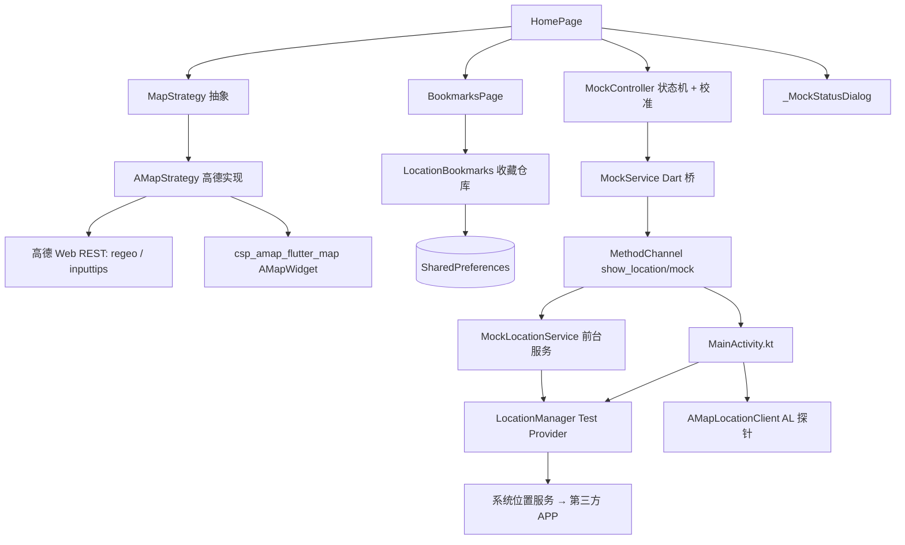

# ShowLocation 架构设计文档（实现版）

> 版本：v1.2 ｜ 更新日期：2026-09-20 ｜ 状态：Android 已实现并真机验证；鸿蒙 / iOS 预留
> 配套：[`requirements.md`](requirements.md)（需求）、[`map_sdk_evaluation.md`](map_sdk_evaluation.md)（SDK 选型）、
> [`../supported_devices.md`](../supported_devices.md)（机型）、[`../RELEASE_GUIDE.md`](../RELEASE_GUIDE.md)（发布）
>
> 说明：本文档早期版本为「设计阶段」稿（描述了尚未存在的 `services/`、`widgets/` 目录与 `map_controller.dart`）。
> 现按代码实际结构重写，**与 `lib/`、`android/` 真实文件一一对应**。

---

## 1. 技术栈

| 项 | 选型 | 实际版本 / 说明 |
|----|------|-----------------|
| 框架 | Flutter + Dart | Dart 约束 `>=3.3.0 <4.0.0`；`pubspec.lock` 要求 Flutter `>=3.44.0` / Dart `>=3.12.0` |
| 地图 | `csp_amap_flutter_map`（本地 path 依赖） | `vendor/csp_amap_flutter_map`，version 1.1.1；修复 `location2Map` 纬度校验 bug；兼容 AGP8 |
| 地图原生 SDK | 高德 `3dmap-location-search` | `10.1.200_loc6.4.9_sea9.7.4`（地图 + 定位 + 搜索整合包） |
| 网络 | `http` | 1.6.0；调高德 Web 服务 `geocode/regeo`、`assistant/inputtips` |
| 权限 | `permission_handler` | 11.4.0 |
| 存储 | `shared_preferences` | 2.5.5（收藏列表 JSON） |
| 状态 | `ValueNotifier` / `ValueListenable` + `StatefulWidget` | 不引入 Provider / Riverpod / Bloc |
| 原生 | Kotlin + MethodChannel + 前台服务 | AGP 8.11.1 / Kotlin 2.2.20 / Gradle 8.14.3 / JVM 17 |
| 密钥管理 | 构建期注入（`--dart-define-from-file`） | `keys/dart_define.example.json` 为模板；`keys/dart_define.json` 已 gitignore，源码内无明文 Key |

---

## 2. 分层架构

```
┌──────────────────────────────────────────────────────────────────────┐
│ 表现层  lib/pages/                                                    │
│   HomePage ──▶ AMapStrategy.buildMap()（地图 widget 来自策略层）        │
│            ├─▶ _SearchBar / _SuggestionList（搜索与联想）              │
│            ├─▶ _PickedLocationBubble（已选位置气泡）                   │
│            └─▶ _MockStatusDialog（模拟状态 / 校准 / 推理）             │
│   BookmarksPage ──▶ BookmarkResult(go|run) 回传 HomePage               │
├──────────────────────────────────────────────────────────────────────┤
│ 业务层  lib/mock_location/ + lib/persistence/                          │
│   MockController：MockState 状态机 + runCalibration 反推 control loop   │
│   LocationBookmarks：收藏仓库（读 / 增 / 删 / always）                  │
├──────────────────────────────────────────────────────────────────────┤
│ 抽象/桥接层                                                            │
│   MapStrategy（接口）◀── AMapStrategy（高德实现：地图/相机/regeo/tips）│
│   MockService（Dart ⇄ 原生 MethodChannel `show_location/mock` 桥）     │
├──────────────────────────────────────────────────────────────────────┤
│ 模型层  lib/models/                                                    │
│   LocationInfo、MapMarker、CameraPosition、LocationBookmark、          │
│   CalibrationProgress、AmapLocationResult / RealLocationSnapshot      │
├──────────────────────────────────────────────────────────────────────┤
│ 平台层  android/                                                       │
│   MainActivity.kt：MethodChannel 9 方法 / 真实定位 / AL 探针             │
│   MockLocationService.kt：前台服务 + 500ms 推送循环 + WakeLock + 通知   │
└──────────────────────────────────────────────────────────────────────┘
```

**依赖方向**：表现层 → 业务层 → 抽象/桥接层 → 模型层；页面只 `import` `MapStrategy`、`MockService`、模型，
不直接调用高德 Dart API（唯一例外：`home_page.dart` 需要 `AMapStrategy.initWithContext(context)` 完成 SDK 初始化）。

---

## 3. 组件关系图



---

## 4. 模块清单（与真实文件对应）

| 文件 | 职责 | 关键 API / 说明 |
|------|------|-----------------|
| `lib/main.dart` | 入口 | `WidgetsFlutterBinding.ensureInitialized()` + `runApp(ShowLocationApp())` |
| `lib/app.dart` | App 壳 | `MaterialApp` + Material 3（`ColorScheme.fromSeed(blue)`），home = `HomePage` |
| `lib/models/location_info.dart` | 位置模型 | 经纬度 / 省市区 / road / address / name；`displayText` 回退顺序：name → address → 省市区道路 → 经纬度 |
| `lib/map/map_strategy.dart` | 地图抽象 | `MapStrategy.init/buildMap/moveCamera/reverseGeocode/inputTips/readLatestLocation`；`CameraPosition`、`MapMarker`、`MapMarkerStyle{pin,car}` |
| `lib/map/amap_strategy.dart` | 高德实现 | SDK 初始化（隐私协议 + Key + 图标）、`buildMap` 组装 `AMapWidget`、`moveCamera`、regeo、inputtips、`setMockActive`、`currentLocation`；Key 取自 `String.fromEnvironment`，缺失时 `hasMapKey/hasWebKey` 为 false 并降级（不崩） |
| `keys/dart_define.example.json` | Key 注入模板 | 三个键：`AMAP_ANDROID_KEY` / `AMAP_IOS_KEY` / `AMAP_WEB_KEY` |
| `lib/mock_location/mock_service.dart` | 原生桥 | 9 个静态方法 + `MockLocationException`；非 Android 平台捕获 `MissingPluginException` 返回失败语义 |
| `lib/mock_location/mock_controller.dart` | 模拟状态机 + 校准 | `start/stop/dispose/cancelCalibration/runCalibration/pauseMockForBackground`；`stateListenable`、`calibrationListenable` |
| `lib/persistence/location_bookmark.dart` | 收藏仓库 | `readAll/add/delete/clear/readAlwaysId/writeAlwaysId`，`maxCount = 10`，key `location_bookmarks_v1` |
| `lib/pages/home_page.dart` | 主页面 | 地图 + 搜索 + 按钮 + 气泡 + 状态对话框 + 生命周期编排（约 1750 行） |
| `lib/pages/bookmarks_page.dart` | 历史列表 | 行展开 / Go / Run / Delete / always；`BookmarkResult{bookmark, action}` |
| `android/.../MainActivity.kt` | 原生通道 | `show_location/mock`（9 方法）、真实定位、AL 探针（`AMapLocationClient`） |
| `android/.../MockLocationService.kt` | 前台服务 | `startForeground`（`FOREGROUND_SERVICE_TYPE_LOCATION`）+ WakeLock + `ScheduledExecutorService` 500ms 推送 |
| `vendor/csp_amap_flutter_map/` | 地图插件 | 本地覆盖版，修复 `location2Map` 纬度校验 bug |
| `test/widget_test.dart` | 测试 | 占位 smoke test（原生插件无法在单测环境运行） |

> 早期文档中提到的 `lib/map/map_controller.dart`、`lib/widgets/*`、`lib/services/*` **均未创建**，
> 对应能力已分别落在 `AMapStrategy`（相机/扎标）与 `HomePage` 内部私有 widget（UI）中。

---

## 5. 关键流程

### 5.1 冷启动定位

```
initState
 ├─ 构造 MockController（注入 readAlProbe = MockService.requestAmapLocation）
 ├─ 注册生命周期观察者 + 申请定位权限
 └─ postFrameCallback
     ├─ AMapStrategy.initWithContext(context)   // 隐私协议 + Key + 图标（必须先于地图创建）
     ├─ setState(_mapReady = true)              // 真正创建 AMapWidget
     ├─ 读取 always 书签 → 有则 _applyBookmarkLocation（启动自动模拟）
     └─ onMapCreated → _onMapCreated()
         ├─ 优先 MockService.requestAmapLocation()（与右上角高德蓝点同源）→ 绿车标 + moveCamera
         └─ 失败兜底 MockService.requestRealLocation()（系统主动定位）→ 绿车标 + moveCamera
```

### 5.2 选点与逆地理

```
点击/长按地图 → AMapStrategy.buildMap 的 onTap/onLongPress（mapInteractive=false 时不传回调）
  → HomePage._onMapTap
    → AMapStrategy.reverseGeocode（高德 Web REST，Web 服务 Key）
    → _selectLocation：蓝扎标(UL) + 气泡显示 + 清空旧探针/偏差/红车标
```

### 5.3 搜索

```
输入变化 → 300ms 防抖 → inputTips → _SuggestionList 联想（过期结果按当前输入丢弃）
点「搜索/回车」→ inputTips → 0 条提示 / 1 条直接采用 / 多条弹底部列表
采用结果 → _applySearchResult → 回填输入框 + _selectLocation + moveCamera（fire-and-forget）
```

### 5.4 模拟位置启动（核心时序）

```
点「应用到系统」→ _applyToSystem → _applyLocation(target)
 1. MockController.start(target)
      ├─ isMockEnabled()? 否 → 跳开发者选项 + 抛 MockLocationException（弹错误对话框）
      └─ 是 → MockService.startMock(lat,lng,mirrorToNetwork: true) → state = running
 2. HomePage：_mapInteractive = false（锁地图手势/点选）、隐藏气泡、
              在 UL 叠加红车标、弹出 _MockStatusDialog、AMapStrategy.setMockActive(true)
 3. 等 250ms + 1500ms → _runProbe()：请求高德定位（最多 3 轮，间隔 3s）
      → 紫 pin(AL) + 计算 UL↔AL 偏差（Haversine）写入 _probeDeviation
 4. 若首轮偏差 > 50m → unawaited(MockController.runCalibration())
```

`AMapStrategy.setMockActive(true/false)` 的作用：
进入模拟时快照 `_currentLocation`（必然为真实 GPS）到 `_lastKnownRealLocation`；退出时恢复，
避免「回到当前位置」跳到模拟坐标；模拟期间 `onLocationChanged` 仍写入 `_currentLocation`（供探针读取），
但 `onFirstLocation` 跳过（避免地图跳到 ML）。

### 5.5 反推校准 control loop

```
runCalibration（`MockController`，参数：4 轮 / 间隔 6s / 收敛 50m / 步长限幅 10km / 停滞阈值 1m / 探针超时 5s / 连续 null 上限 2）
for i = 1..4:
  i >= 2: ML_i = 2·UL − AL_{i-1}  →  _clampStep 限幅到距 UL 10km 内
                                   →  MockService.updateMockTarget(lat,lng)（同步给前台服务）
  等 6s（给 SDK 重新分发 + 回调） → readAlProbe(5s) 取 AL
  偏差 dist = haversine(UL, AL)
  判停：
    - dist < 50m                        → success
    - |dist − prevDist| < 1m（连续两轮） → failed（疑似风控）
    - readProbe 连续 2 次 null（第 1 轮宽容）→ failed（疑似风控）
    - 跑满 4 轮未收敛                    → failed（达最大迭代次数）
```

每次状态变化都写入 `calibrationListenable`，`_MockStatusDialog` 用 `ValueListenableBuilder` 自监听实时刷新。

### 5.6 停止模拟

```
点「停止模拟」→ _stopMock
 → MockController.stop()（取消校准 + MockService.stopMock() 停止前台服务 + 状态置 idle + 重置校准进度）
 → AMapStrategy.setMockActive(false)（恢复真实定位快照）
 → 关闭状态对话框、解锁地图、清除红车标与探针状态 → SnackBar「已停止模拟」
```

`AMapStrategy.clearCurrentLocation()` 仍保留但**不再在 stop 流程中调用**：SDK 停止后不会主动重订阅真实 GPS，
清空会导致「回到当前位置」永久拿不到值；现改为由下一帧真实 fix 自然覆盖。

---

## 6. MethodChannel 契约（`show_location/mock`）

仅 Android 实现（`MainActivity.kt`）；iOS / 桌面调用返回失败语义（`MissingPluginException` → null / false）。

| 方法 | 参数 | 返回 / 作用 |
|------|------|-------------|
| `isMockEnabled` | — | Bool：是否已授予「模拟位置应用」（`AppOpsManager.OPSTR_MOCK_LOCATION`） |
| `openDevOptions` | — | 跳转「开发者选项」页（用户手动选择本 APP） |
| `setAmapApiKey` | `key` | 把高德 Android Key 传给定位 SDK（AL 探针的 `AMapLocationClient` 需独立 Key，`initWithContext` 时由 Dart 侧调用一次） |
| `startMock` | `lat,lng,mirrorToNetwork=true` | **启动前台服务**，内部每 500ms 循环推送（推荐路径） |
| `updateMockTarget` | `lat,lng` | 更新前台服务推送目标（反推校准用） |
| `stopMock` | — | 停止前台服务 |
| `readRealLocation` | — | 被动读 `getLastKnownLocation(GPS)` 缓存 |
| `requestRealLocation` | — | **主动**请求一帧真实 fix（8s 超时，先读 60s 内缓存） |
| `requestAmapLocation` | — | **AL 探针**：`AMapLocationClient` 单次定位（8s 超时，`setMockEnable(true)`） |

推送细节（`MockLocationService` 前台服务）：每 500ms 一次；`elapsedRealtimeNanos` 严格单调递增
（不足则 +500ms）；`extras` 携带 `satellites=8`、`maxCn0=40`、`distance`（累计）、`bearing`；
`bearing = (pushCount × 0.5) % 360`、`speed = 3f`、`accuracy = 5f`。

---

## 7. 扎标语义与颜色约定

| 扎标 | 颜色 / 图标 | 含义 | 生命周期 |
|------|-------------|------|----------|
| 真实位置 | 绿车标 `car_green.png` | 真实定位结果 | 定位成功后常驻 |
| 模拟位置 | 红车标 `car_red.png` | 当前注入的 ML（等于 UL，除非校准调整） | 模拟期间显示，停止后消失 |
| 用户选点 | 蓝 pin `pin_blue.png` | UL | 未模拟时显示，模拟期间被红车标替代 |
| AMap 探针 | 紫 pin `pin_violet.png` | AL（高德视角位置） | 探针成功后显示，选新点 / 停止模拟时清除 |

图标由 `AMapStrategy.ensureIcons()` 从 `assets/icons/` 一次性加载，`_resolveMarkerIcon` 按「样式 + 颜色语义」映射。

---

## 8. 状态机

```dart
enum MockState { idle, preparing, running, error }          // MockController.stateListenable
enum CalibrationState { idle, running, success, failed }    // MockController.calibrationListenable
```

| MockState | 触发 | UI 表现 |
|-----------|------|---------|
| `idle` | 初始 / `stop()` | 按钮「应用到系统」，地图可交互 |
| `preparing` | 权限检查通过后调 `startMock` 期间 | 按钮「停止模拟」，对话框标题「准备中」 |
| `running` | `startMock` 成功 | 按钮「停止模拟」，地图锁定，对话框实时刷新 |
| `error` | 原生调用抛异常 | 弹「Mock Location 未生效」对话框，附可读原因 |

对话框自动关闭条件：`_MockStatusDialogState` 监听 `MockState` 回到 `idle`。

---

## 9. 权限与数据

| 平台 | 声明位置 | 内容 |
|------|----------|------|
| Android | `android/app/src/main/AndroidManifest.xml` | `ACCESS_FINE_LOCATION`、`ACCESS_COARSE_LOCATION`、`INTERNET`、`ACCESS_MOCK_LOCATION`、`FOREGROUND_SERVICE`、`FOREGROUND_SERVICE_LOCATION`、`WAKE_LOCK`；`<service .MockLocationService foregroundServiceType="location" exported="false">` |
| Android 运行时 | `permission_handler` | `Permission.locationWhenInUse`；永久拒绝时引导到系统设置 |
| iOS | `ios/Runner/Info.plist` | **缺失**定位权限描述（`NSLocationWhenInUseUsageDescription`），需在 iOS 适配阶段补 |
| 本地数据 | `SharedPreferences` | 收藏列表 `location_bookmarks_v1`、always 书签 id `location_bookmarks_always_id_v1` |
| 高德 Key | `keys/dart_define.json`（不入库）+ `--dart-define-from-file` 注入 | Android Key / iOS Key（留空回退 Android Key）/ Web 服务 Key；源码内**无明文 Key**；缺失时地图不加载并弹 SnackBar 提示 |

高德隐私合规：`AMapInitializer.updatePrivacyAgree(hasContains/hasShow/hasAgree = true)` —— 目前**默认视为已同意**，
正式发布前需接入隐私弹窗后按用户选择调用。

---

## 10. 平台适配策略与现状

| 平台 | 现状 | 后续路径 |
|------|------|----------|
| Android | ✅ 已实现（代码 + 权限 + 前台服务 + Test Provider + AL 探针） | 升级 Gradle/AGP/Kotlin；Key 加固 |
| iOS | ⚠️ 仅工程骨架：无 `Podfile`、`Info.plist` 无定位权限描述、`AppDelegate` 未配置高德 Key、无 mock 通道 | 补权限描述与高德 Key，接入 `AMap3DMap`（vendor podspec 已声明 `s.dependency 'AMap3DMap'`，平台 iOS 12+） |
| 鸿蒙双框架机型（如 P60） | 可直接安装 Android APK，按 Android 路径运行 | 见 [`华为P60.md`](华为P60.md) |
| HarmonyOS NEXT / OpenHarmony | ❌ 未适配（无 `ohos/` 工程与高德鸿蒙 SDK） | Flutter 鸿蒙分支 + 高德鸿蒙 SDK，经 `MapStrategy` 接入，页面零改动 |
| 桌面（Windows/macOS/Linux） | UI 可编译运行，mock 相关能力全部降级（`MissingPluginException` 被捕获） | 非目标 |

---

## 11. 已知问题与技术债

| # | 问题 | 影响 | 建议 |
|---|------|------|------|
| 1 | 高德 Key 曾以明文提交到公开仓库（现已改为构建期注入） | **历史 Key 视为泄露**，可被盗用刷配额 | 去高德控制台删除旧 Key 并重新生成，新 Key 只放 `keys/dart_define.json` |
| 2 | ~~构建工具版本临近 Flutter 支持下限~~ | — | ✅ 已升级至 Gradle 8.14.3 / AGP 8.11.1 / Kotlin 2.2.20 |
| 3 | 隐私合规：`updatePrivacyAgree(hasAgree: true)` 默认视为同意 | 若对外分发存在合规风险 | 接入隐私弹窗后按用户选择初始化 SDK |
| 4 | ~~`clipboard`、`fluttertoast` 已无引用~~ | — | ✅ 已从 `pubspec.yaml` 移除（含 iOS 注册文件同步清理） |
| 5 | 单元测试仅占位 | 重构无回归保护 | 为反推公式、Haversine、收敛判定补纯逻辑单测 |
| 6 | `home_page.dart` 单文件约 1750 行，UI/编排/网络回调混合 | 维护成本 | 按「搜索 / 气泡 / 对话框 / 状态编排」拆分 |
| 7 | 第三方 APP 反 Mock 无法根除 | 效果不保证 | 属系统级限制，文档中已明示 |
| 8 | iOS 完全未接入 | 无法在 iOS 使用 | 补齐 Podfile / 权限描述 / Key 与通道实现 |

---

## 12. 风险与应对

| 风险 | 应对 |
|------|------|
| 高德 Key 绑定错误（包名 / SHA1 / BundleId）导致地图空白 | 调试与发布签名分别绑定 Key；若原生报 `Unresolved reference 'amap'`，检查 `app/build.gradle.kts` 中的整合包依赖（`csp` 插件用 `implementation` 不外泄，需 app 模块显式声明） |
| 前台服务被 ROM 冻结（华为鸿蒙节能） | 已用 `FOREGROUND_SERVICE_TYPE_LOCATION` + `PARTIAL_WAKE_LOCK`；P60 上需将 APP 加入「忽略电池优化」白名单 |
| 逆地理 / 搜索依赖网络 | `LocationInfo.displayText` 已做多级回退；无网时退化为经纬度 |
| 插件本地覆盖与版本升级冲突 | `vendor/` 与 pub.dev 版本分离，升级时需重新比对 `location2Map` 修复 |
| 用户误以为「一定能骗过所有 APP」 | 文档（README / requirements / mock_location_zh）中明确标注反 Mock 限制 |
